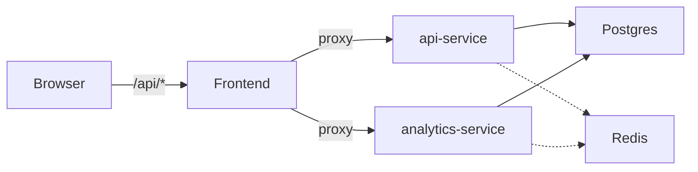

# Latency Lab — Notes Service

A small Go-microservice notes/paste app for experimenting with **conditional latency injection** and **fault injection** via query parameters. Same overall shape as
[`openchoreo/sample-workloads/project-url-shortener`](https://github.com/openchoreo/sample-workloads/tree/main/project-url-shortener) (frontend BFF + api-service + analytics-service + Postgres + Redis), with knobs you can twist on every API call.

## Architecture



- **frontend** — static page + reverse-proxy BFF (port 9700)
- **api-service** — create / read / list / delete notes (port 9701)
- **analytics-service** — per-note view stats (port 9702)
- **postgres** — `notes`, `views` tables
- **redis** — optional read-through cache (nil-safe)

## Run

```bash
docker compose up --build
```

Open http://localhost:9700.

## Latency / fault injection

Every API endpoint accepts three optional query parameters:

| Param         | Type  | Meaning                                                                 |
| ------------- | ----- | ----------------------------------------------------------------------- |
| `delay_ms`    | int   | Sleep this many milliseconds at the chosen stage(s).                    |
| `delay_stage` | enum  | Where to sleep: `handler` (default), `cache`, `db`, `all`.              |
| `fail_rate`   | float | 0.0–1.0 probability of returning HTTP 500 instead of the real response. |

The params propagate through the BFF, so calling them on `/api/...` works end-to-end.

### Examples

```bash
# Healthy create
curl -X POST localhost:9700/api/notes \
  -H 'content-type: application/json' \
  -d '{"author":"alice","body":"hello"}'

# Add 800ms in the DB layer
curl "localhost:9700/api/notes?delay_ms=800&delay_stage=db" \
  -X POST -H 'content-type: application/json' \
  -d '{"author":"alice","body":"slow db"}'

# 250ms at every stage + 20% chance of failure
curl "localhost:9700/api/notes/abcd1234?delay_ms=250&delay_stage=all&fail_rate=0.2"

# Slow analytics fetch
curl "localhost:9700/api/analytics/abcd1234?delay_ms=1500&delay_stage=handler"
```

## API

| Method | Path                       | Notes                            |
| ------ | -------------------------- | -------------------------------- |
| POST   | `/api/notes`               | body: `{author, body}`           |
| GET    | `/api/notes`               | `?author=alice` to filter        |
| GET    | `/api/notes/{id}`          | also bumps view count            |
| DELETE | `/api/notes/{id}`          |                                  |
| GET    | `/api/analytics/{id}`      | view count + recent timestamps   |
| GET    | `/api/analytics/top`       | most-viewed notes                |
| GET    | `/health`                  | per-service                      |

All endpoints honor `delay_ms`, `delay_stage`, `fail_rate`.
